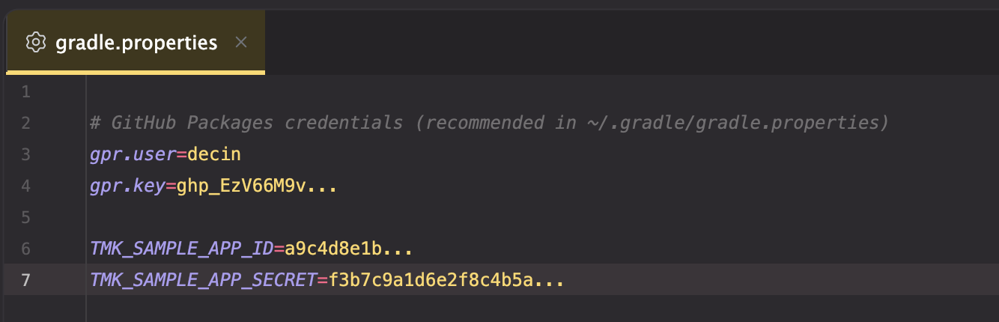
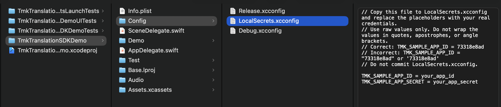

# Tmk Translation SDK 开发指南

## 一、产品简介

Tmk Translation SDK 是时空壶统一的实时语音翻译能力封装，为开发者提供了一套全链路的语音翻译解决方案。该 SDK 整合了 **语音识别（ASR）** 、 **智能翻译（MT/LLM）** 和 **文本转语音（TTS）** 三大核心能力，支持在 Android 和 iOS 平台上快速集成，实现高质量的实时语音翻译功能。

**核心能力与支持**

- **全链路翻译** ：提供从语音输入到语音输出的完整翻译链路，包括语音识别、机器翻译和大模型翻译和语音合成。音频输入输出是 **16 kHz 采样率、16\-bit 位深的 PCM**。

- **多平台支持** ：同时支持 Android 和 iOS 两大主流移动平台。

- **丰富的语种** ：

    - **在线模式** ：支持 55 种语种，覆盖 109 种口音。

    ```JSON
    {
      "en-US": "英语(美国)",
      "en-GB": "英语(英国)",
      "en-IE": "英语(爱尔兰)",
      "en-CA": "英语(加拿大)",
      "en-AU": "英语(澳大利亚)",
      "en-NZ": "英语(新西兰)",
      "en-IN": "英语(印度)",
      "en-PH": "英语(菲律宾)",
      "en-ZA": "英语(南非)",
      "en-KE": "英语(肯尼亚)",
      "en-TZ": "英语(坦桑尼亚)",
      "en-NG": "英语(尼日利亚)",
      "en-GH": "英语(加纳)",
      "en-SG": "英语(新加坡)",
      "zh-CN": "中文(简体)",
      "zh-TW": "中文(繁体)",
      "zh-HK": "中文(粤语)",
      "fr-FR": "法语(法国)",
      "fr-CA": "法语(加拿大)",
      "es-MX": "西班牙语(墨西哥)",
      "es-ES": "西班牙语(西班牙)",
      "es-US": "西班牙语(美国)",
      "es-HN": "西班牙语(洪都拉斯)",
      "es-NI": "西班牙语(尼加拉瓜)",
      "es-PA": "西班牙语(巴拿马)",
      "es-CR": "西班牙语(哥斯达黎加)",
      "es-AR": "西班牙语(阿根廷)",
      "es-CL": "西班牙语(智利)",
      "es-BO": "西班牙语(玻利维亚)",
      "es-CO": "西班牙语(哥伦比亚)",
      "es-DO": "西班牙语(多米尼克)",
      "es-EC": "西班牙语(厄瓜多尔)",
      "es-GT": "西班牙语(危地马拉)",
      "es-PE": "西班牙语(秘鲁)",
      "es-PR": "西班牙语(波多黎各)",
      "es-PY": "西班牙语(巴拉圭)",
      "es-UY": "西班牙语(乌拉圭)",
      "es-VE": "西班牙语(委内瑞拉)",
      "es-SV": "西班牙语(萨尔瓦多)",
      "pt-PT": "葡萄牙语(葡萄牙)",
      "pt-BR": "葡萄牙语(巴西)",
      "de-DE": "德语(德国)",
      "it-IT": "意大利语(意大利)",
      "ru-RU": "俄语(俄罗斯)",
      "ar-EG": "阿拉伯语(埃及)",
      "ar-DZ": "阿拉伯语(阿尔及利亚)",
      "ar-TN": "阿拉伯语(突尼斯)",
      "ar-MA": "阿拉伯语(摩洛哥)",
      "ar-SA": "阿拉伯语(沙特阿拉伯)",
      "ar-OM": "阿拉伯语(阿曼)",
      "ar-AE": "阿拉伯语(阿联酋)",
      "ar-QA": "阿拉伯语(卡塔尔)",
      "ar-BH": "阿拉伯语(巴林)",
      "ar-IQ": "阿拉伯语(伊拉克)",
      "ar-JO": "阿拉伯语(约旦)",
      "ar-KW": "阿拉伯语(科威特)",
      "ar-LB": "阿拉伯语(黎巴嫩)",
      "ar-PS": "阿拉伯语(巴勒斯坦)",
      "ar-IL": "阿拉伯语(以色列)",
      "ja-JP": "日语(日本)",
      "ko-KR": "韩语(韩国)",
      "id-ID": "印尼语(印尼)",
      "hi-IN": "印地语(印度)",
      "th-TH": "泰语(泰国)",
      "te-IN": "泰卢固语(印度)",
      "ta-IN": "泰米尔语(印度)",
      "ta-SG": "泰米尔语(新加坡)",
      "ta-LK": "泰米尔语(斯里兰卡)",
      "ta-MY": "泰米尔语(马来西亚)",
      "ur-PK": "乌尔都语(巴基斯坦)",
      "ur-IN": "乌尔都语(印度)",
      "vi-VN": "越南语(越南)",
      "ms-MY": "马来语(马来西亚)",
      "nb-NO": "挪威语(挪威)",
      "sv-SE": "瑞典语(瑞典)",
      "fi-FI": "芬兰语(芬兰)",
      "da-DK": "丹麦语(丹麦)",
      "nl-NL": "荷兰语(荷兰)",
      "ca-ES": "加泰罗尼亚语(西班牙)",
      "he-IL": "希伯来语(以色列)",
      "el-GR": "希腊语(希腊)",
      "hu-HU": "匈牙利语(匈牙利)",
      "pl-PL": "波兰语(波兰)",
      "cs-CZ": "捷克语(捷克)",
      "sk-SK": "斯洛伐克语(斯洛伐克)",
      "ro-RO": "罗马尼亚语(罗马尼亚)",
      "sl-SI": "斯洛文尼亚语(斯洛文尼亚)",
      "hr-HR": "克罗地亚语(克罗地亚)",
      "bg-BG": "保加利亚语(保加利亚)",
      "tr-TR": "土耳其语(土耳其)",
      "uk-UA": "乌克兰语(乌克兰)",
      "is-IS": "冰岛语(冰岛)",
      "fil-PH": "菲律宾语(菲律宾)",
      "bn-IN": "孟加拉语(印度)",
      "my-MM": "缅甸语(缅甸)",
      "fa-IR": "波斯语(伊朗)",
      "sw-KE": "斯瓦希里语(肯尼亚)",
      "sw-TZ": "斯瓦希里语(坦桑尼亚)",
      "mn-MN": "蒙古语(蒙古)",
      "uz-UZ": "乌兹别克语(乌兹别克斯坦)",
      "sr-RS": "塞尔维亚语(塞尔维亚)",
      "lt-LT": "立陶宛语(立陶宛)",
      "az-AZ": "阿塞拜疆语(阿塞拜疆)",
      "ka-GE": "格鲁吉亚语(格鲁吉亚)",
      "lv-LV": "拉脱维亚语(拉脱维亚)",
      "et-EE": "爱沙尼亚语(爱沙尼亚)",
      "lo-LA": "老挝语(老挝语（老挝))",
      "sq-AL": "阿尔巴尼亚语(阿尔巴尼亚)",
      "km-KH": "高棉语(柬埔寨)",
      "ne-NP": "尼泊尔语(尼泊尔)"
    }
    ```

    - **离线模式** ：支持 11 种语种（中、英、日、韩、法、西、俄、德、意、阿、泰）的“主要语种\-其他语种”的互译，满足无网络环境下的翻译需求。

        ```Plain Text
        {
          "zh": "中文",
          "en": "英语",
          "ja": "日语",
          "ko": "韩语",
          "fr": "法语",
          "es": "西班牙语",
          "ru": "俄语",
          "de": "德语",
          "it": "意大利语",
          "ar": "阿拉伯语",
          "th": "泰语"
        }
        ```

        目前支持有限语言对如下：

        1. **中文翻译对：**中文普通话\-英语、~~中文普通话\-粤语~~、中文普通话\-日语、中文普通话\-西语、中文普通话\-俄语、中文普通话\-韩语、中文普通话\-德语、中文普通话\-法语、中文普通话\-意大利语、中文普通话\-阿拉伯语、**中文普通话\-泰语**

        2. **英文翻译对：**英语\-中文普通话、~~英语\-粤语~~、英语\-日语、英语\-西语、英语\-俄语、英语\-韩语、英语\-德语、英语\-法语、英语\-意大利语、英语\-阿拉伯语、**英语\-泰语**

## 二、快速体验

本章节将引导您在 10 分钟内完成 Tmk Translation SDK 的Demo体验。

### 1、获取演示Demo

- Demo App：https://www\.pgyer\.com/tmktranslationsample 安装密码：tmktrans

- **Demo 源码链接** ：[https://github\.com/timekettle/tmk\-translation\-sdk\-samples](https://github.com/timekettle/tmk-translation-sdk-samples)

- **SDK 链接** ：

    - iOS SDK 链接：

        - Pod Specs https://github\.com/timekettle/TmkTranslationSDK\-iOS\.git 

        - XCFramwork https://github\.com/timekettle/TmkTranslationSDK\-xcframework\.git

    - Android  SDK 链接：https://github\.com/timekettle/tmk\-translation\-sdk\-dist

~~注意：届时提供合作者的 GitHub 账号，时空壶技术团队会对此账号开放以上私有 Maven/CocoaPods 仓库权限，在自己账号内生成 PAT（设置权限 read:packages），来提供 SDK 的访问权限。~~

更新：SDK 已经发布到Cocoapods和Maven Central，可直接安装使用

- **集成 SDK** ：

    - **Android** ：通过 Gradle 依赖引入 SDK。

    - **iOS** ：通过 CocoaPods 集成，使用命令：pod install \-\-repo\-update 安装，CocoaPods建议升级到1\.16\.2。

### 2、配置演示Demo

1. **获取凭证** ：请联系时空壶技术团队申请 AppID 和 AppSecret。

2. **配置**

- Android（填写GitHub用户名和PAT）



- iOS



配置好后即可运行Demo进行体验SDK相关翻译场景

## 三、架构和业务说明

请查看[Tmk Translation SDK架构及业务流程说明](https://timekettle.feishu.cn/wiki/HyVfwBjI3i9cUDkqnNpcSOLnnkg)架构及业务说明，以便你更好的理解SDK是如何工作的

## 四、接入文档

如果你想快速在您的App中接入Tmk Translation SDK，请根据平台查看对应接入文档

### 1、Android接入文档

[android\_api](https://timekettle.feishu.cn/wiki/EGHnwKR8yi6QwQkNZjpcKjLdnef)

### 2、iOS接入文档

[ios\_api](https://timekettle.feishu.cn/wiki/Ce6Lwt8cQir3rwkGPgdcn0lxnde)

### 3、数据处理说明

[TmkTranslationSDK 对话业务数据处理逻辑](https://timekettle.feishu.cn/wiki/V4yywhwOWiGn3pkaPlQc5eDpnff)

## 五、技术团队

如有问题请联系时空壶技术团队 

项目技术主管：@谢友希

客户端负责人：@石钦

后端负责人：@郑寅雍

后端开发工程师：@陈世彬

SDK开发工程师：@熊进辉

## 


